# Peer Platform - System Architecture Diagrams (Mermaid)

> **Industry-Standard C4 Model & Flowchart Diagrams**
> Copy and paste each diagram into [Mermaid Live Editor](https://mermaid.live) or any Mermaid-compatible tool.

---

## 1. Peer v1.0 - Current System Architecture

```mermaid
flowchart TB
    subgraph External["🌐 External Services"]
        direction TB
        GH["<b>GitHub Platform</b><br/>─────────────────<br/>• PR Events<br/>• Repository Access<br/>• OAuth Provider"]
        RZP["<b>Razorpay</b><br/>─────────────────<br/>• Payment Processing<br/>• Subscription Billing"]
    end

    subgraph LLMProviders["🤖 AI/LLM Providers"]
        direction LR
        GEMINI["<b>Google Gemini</b><br/>─────────────────<br/>• gemini-1.5-flash<br/>• gemini-1.5-pro"]
        GROQ["<b>Groq API</b><br/>─────────────────<br/>• llama-3-70b<br/>• mixtral-8x7b"]
        OPENAI["<b>OpenAI</b><br/>─────────────────<br/>• gpt-4-turbo<br/>• gpt-3.5-turbo"]
        OPENR["<b>OpenRouter</b><br/>─────────────────<br/>• Multi-model Access"]
        DEEPSEEK["<b>DeepSeek</b><br/>─────────────────<br/>• deepseek-coder"]
    end

    subgraph ClientLayer["👤 Client Layer"]
        USER["<b>Developer/User</b>"]
        BROWSER["<b>Web Browser</b><br/>─────────────────<br/>• Dashboard Access<br/>• Settings Management"]
    end

    subgraph LoadBalancer["⚖️ Load Balancer"]
        LB["<b>Render.com LB</b><br/>─────────────────<br/>• SSL Termination<br/>• Request Routing"]
    end

    subgraph UIService["🎨 UI Service (Port 3000)"]
        direction TB
        UI["<b>Express.js + EJS</b><br/>─────────────────<br/>• Server-Side Rendering<br/>• Session Management"]
        
        subgraph UIViews["Views"]
            DASH["Dashboard"]
            AUDIT["Audit History"]
            PREVIEW["Code Preview"]
            SETTINGS["Settings"]
            PAYMENT["Payment Pages"]
        end
        UI --> UIViews
    end

    subgraph APIService["⚙️ API Service (Port 3001)"]
        direction TB
        API["<b>Express.js REST API</b><br/>─────────────────<br/>• Route Handling<br/>• Request Validation"]
        
        subgraph APIModules["Modules"]
            WEBHOOK["Webhook Handler<br/>(GitHub Events)"]
            AUTH["Passport.js Auth<br/>(GitHub OAuth)"]
            PAYCTRL["Payment Controller<br/>(Razorpay Integration)"]
            RESTROUTES["REST API Routes<br/>(/api/v1/*)"]
        end
        API --> APIModules
    end

    subgraph QueueSystem["📮 Queue System"]
        REDIS[("🔴 <b>Redis</b><br/>─────────────────<br/>• BullMQ Queues<br/>• LLM Response Cache<br/>• Session Store")]
        QMGR["<b>Queue Manager</b><br/>─────────────────<br/>• Job Scheduling<br/>• Priority Handling<br/>• Retry Logic"]
    end

    subgraph AnalyzerWorker["🔍 Analyzer Worker"]
        direction TB
        AW["<b>Static Analysis Engine</b><br/>─────────────────<br/>• Language Detection<br/>• Finding Aggregation"]
        
        subgraph Analyzers["Static Analyzers"]
            ESLINT["ESLint<br/>(JS/TS)"]
            SEMGREP["Semgrep<br/>(Multi-lang)"]
            BANDIT["Bandit<br/>(Python)"]
            PMD["PMD<br/>(Java)"]
            CHECKOV["Checkov<br/>(IaC/Terraform)"]
            HADOLINT["Hadolint<br/>(Dockerfile)"]
        end
        AW --> Analyzers
    end

    subgraph AutofixWorker["🔧 Autofix Worker"]
        direction TB
        AFW["<b>AI Code Fixer</b><br/>─────────────────<br/>• Fix Generation<br/>• Syntax Validation"]
        
        subgraph AutofixModules["Modules"]
            LLMENG["LLM Engine<br/>(Multi-provider)"]
            PATCHGEN["Patch Generator<br/>(Unified Diff)"]
            GITOPS["Git Operations<br/>(Branch/Commit/PR)"]
        end
        AFW --> AutofixModules
    end

    subgraph DepScanWorker["🛡️ Security Scanner"]
        direction TB
        DSW["<b>Dependency Scanner</b><br/>─────────────────<br/>• Vulnerability Detection<br/>• License Checking"]
        
        subgraph ScanModules["Scanners"]
            NPMAUDIT["npm audit"]
            PIPAUDIT["pip-audit"]
            IACCHECK["IaC Scanner"]
        end
        DSW --> ScanModules
    end

    subgraph SharedServices["🔗 Shared Services Layer"]
        direction LR
        GHSVC["<b>GitHub Service</b><br/>─────────────────<br/>• App Authentication<br/>• API Wrapper<br/>• Token Management"]
        LLMSVC["<b>LLM Service</b><br/>─────────────────<br/>• Provider Selection<br/>• Fallback Logic<br/>• Response Parsing"]
        EMAILSVC["<b>Email Service</b><br/>─────────────────<br/>• Nodemailer<br/>• Notifications"]
        ENCRYPT["<b>Encryption Service</b><br/>─────────────────<br/>• AES-256 Encryption<br/>• Key Management"]
        CACHE["<b>Cache Service</b><br/>─────────────────<br/>• LLM Response Cache<br/>• Rate Limit Tracking"]
    end

    subgraph DataLayer["💾 Data Layer"]
        MONGO[("🍃 <b>MongoDB</b><br/>─────────────────<br/>• Primary Database<br/>• Document Store")]
        
        subgraph Models["Data Models"]
            USERMODEL["User"]
            PRMODEL["PRRun"]
            INSTMODEL["Installation"]
            PATCHMODEL["PatchRequest"]
            NOTIFMODEL["Notification"]
        end
    end

    %% === CONNECTIONS ===
    
    %% Client Flow
    USER --> BROWSER
    BROWSER --> LB
    LB --> UI
    LB --> API

    %% GitHub Integration
    GH -->|"Webhook Events"| WEBHOOK
    GH <-->|"REST API Calls"| GHSVC
    GH <-->|"OAuth Flow"| AUTH

    %% Payment Flow
    RZP <-->|"Payment API"| PAYCTRL

    %% UI to API
    UI <-->|"Internal API"| API
    UI --> MONGO

    %% Queue System
    WEBHOOK -->|"Enqueue Jobs"| QMGR
    QMGR <--> REDIS
    QMGR -->|"Analysis Jobs"| AW
    QMGR -->|"Autofix Jobs"| AFW
    QMGR -->|"Security Jobs"| DSW

    %% Worker to Services
    AW --> GHSVC
    AFW --> GHSVC
    AFW --> LLMSVC
    DSW --> MONGO

    %% LLM Connections
    LLMSVC --> GEMINI
    LLMSVC --> GROQ
    LLMSVC --> OPENAI
    LLMSVC --> OPENR
    LLMSVC --> DEEPSEEK
    LLMSVC --> CACHE
    CACHE --> REDIS

    %% Database Connections
    API --> MONGO
    AW --> MONGO
    AFW --> MONGO
    MONGO --> Models

    %% Notification Flow
    AW --> EMAILSVC
    AFW --> EMAILSVC

    %% Security
    API --> ENCRYPT
    PAYCTRL --> ENCRYPT

    %% Styling
    classDef external fill:#1a1a2e,stroke:#4cc9f0,stroke-width:2px,color:#fff
    classDef llm fill:#2d132c,stroke:#ee5a24,stroke-width:2px,color:#fff
    classDef service fill:#0a3d62,stroke:#78e08f,stroke-width:2px,color:#fff
    classDef worker fill:#4a148c,stroke:#ce93d8,stroke-width:2px,color:#fff
    classDef database fill:#1b5e20,stroke:#a5d6a7,stroke-width:2px,color:#fff
    classDef queue fill:#b71c1c,stroke:#ef9a9a,stroke-width:2px,color:#fff
    classDef shared fill:#004d40,stroke:#80cbc4,stroke-width:2px,color:#fff

    class GH,RZP external
    class GEMINI,GROQ,OPENAI,OPENR,DEEPSEEK llm
    class UI,API service
    class AW,AFW,DSW worker
    class MONGO,REDIS database
    class GHSVC,LLMSVC,EMAILSVC,ENCRYPT,CACHE shared
```



---

## 2. Peer v2.0 - Future RAG-Powered Architecture

```mermaid
flowchart TB
    subgraph External["🌐 External Services"]
        direction TB
        GH["<b>GitHub Platform</b><br/>─────────────────<br/>• PR Events<br/>• Repository Access<br/>• OAuth Provider"]
        RZP["<b>Razorpay</b><br/>─────────────────<br/>• Payment Processing<br/>• Subscription Billing"]
    end

    subgraph LLMProviders["🤖 AI/LLM Providers"]
        direction LR
        GEMINI["<b>Google Gemini</b><br/>─────────────────<br/>• gemini-1.5-flash<br/>• gemini-1.5-pro<br/>• text-embedding-004"]
        GROQ["<b>Groq API</b><br/>─────────────────<br/>• llama-3-70b<br/>• mixtral-8x7b"]
        OPENAI["<b>OpenAI</b><br/>─────────────────<br/>• gpt-4-turbo<br/>• gpt-3.5-turbo"]
        OPENR["<b>OpenRouter</b><br/>─────────────────<br/>• Multi-model Access"]
        DEEPSEEK["<b>DeepSeek</b><br/>─────────────────<br/>• deepseek-coder"]
        JINA["<b>Jina AI</b><br/>─────────────────<br/>• Backup Embeddings"]
    end

    subgraph ClientLayer["👤 Client Layer"]
        USER["<b>Developer/User</b>"]
        BROWSER["<b>Web Browser</b><br/>─────────────────<br/>• Dashboard Access<br/>• Learning Feedback<br/>• Settings Management"]
    end

    subgraph LoadBalancer["⚖️ Load Balancer"]
        LB["<b>Render.com LB</b><br/>─────────────────<br/>• SSL Termination<br/>• Request Routing"]
    end

    subgraph UIService["🎨 UI Service (Port 3000)"]
        direction TB
        UI["<b>Express.js + EJS</b><br/>─────────────────<br/>• Server-Side Rendering<br/>• Session Management"]
        
        subgraph UIViews["Views"]
            DASH["Dashboard"]
            AUDIT["Audit History"]
            PREVIEW["Code Preview"]
            SETTINGS["Settings"]
            PAYMENT["Payment Pages"]
            LEARNING["Learning Insights"]
        end
        UI --> UIViews
    end

    subgraph APIService["⚙️ API Service (Port 3001)"]
        direction TB
        API["<b>Express.js REST API</b><br/>─────────────────<br/>• Route Handling<br/>• Request Validation"]
        
        subgraph APIModules["Modules"]
            WEBHOOK["Webhook Handler<br/>(GitHub Events)"]
            AUTH["Passport.js Auth<br/>(GitHub OAuth)"]
            PAYCTRL["Payment Controller<br/>(Razorpay Integration)"]
            RESTROUTES["REST API Routes<br/>(/api/v1/*)"]
            FEEDBACKAPI["Feedback API<br/>(Learning Input)"]
        end
        API --> APIModules
    end

    subgraph QueueSystem["📮 Queue System"]
        REDIS[("🔴 <b>Redis</b><br/>─────────────────<br/>• BullMQ Queues<br/>• LLM Response Cache<br/>• Session Store<br/>• Rate Limiting")]
        QMGR["<b>Queue Manager</b><br/>─────────────────<br/>• Job Scheduling<br/>• Priority Handling<br/>• Retry Logic<br/>• Indexing Priority"]
    end

    subgraph IndexerWorker["📚 Repository Indexer Worker"]
        direction TB
        INDEXER["<b>Repository Indexer</b><br/>─────────────────<br/>• Triggered on Install<br/>• Incremental Updates"]
        
        subgraph IndexModules["Indexing Pipeline"]
            CLONER["Git Cloner<br/>(Shallow Clone)"]
            STACKDET["Stack Detector<br/>(MERN/Django/etc)"]
            CHUNKER["Code Chunker<br/>(AST-based)"]
            EMBEDGEN["Embedding Generator<br/>(Gemini text-embedding-004)"]
        end
        INDEXER --> IndexModules
    end

    subgraph VectorStore["🧠 Vector Database Layer"]
        CHROMA[("🔮 <b>ChromaDB</b><br/>─────────────────<br/>• Vector Storage<br/>• Similarity Search<br/>• Metadata Filtering")]
        
        subgraph Collections["Collections per Repo"]
            FILECOL["files/<br/>(File Content Chunks)"]
            FUNCCOL["functions/<br/>(Function-level Chunks)"]
            IMPORTCOL["imports/<br/>(Dependency Graph)"]
            METACOL["metadata/<br/>(Config, README)"]
        end
        CHROMA --> Collections
    end

    subgraph RAGEngine["🎯 RAG Context Engine"]
        direction TB
        RAGCTX["<b>RAG Context Builder</b><br/>─────────────────<br/>• Context Compilation<br/>• Token Budget Management<br/>• Relevance Ranking"]
        
        subgraph RAGModules["Context Modules"]
            SIMQUERY["Similarity Query<br/>(Vector Search)"]
            DEPQUERY["Dependency Query<br/>(Import/Export Graph)"]
            CONFIGQUERY["Config Query<br/>(package.json, etc)"]
            DOCSQUERY["Docs Query<br/>(README, Comments)"]
        end
        RAGCTX --> RAGModules
    end

    subgraph AnalyzerWorker["🔍 Analyzer Worker"]
        direction TB
        AW["<b>Static Analysis Engine</b><br/>─────────────────<br/>• Language Detection<br/>• Finding Aggregation<br/>• RAG Integration"]
        
        subgraph Analyzers["Static Analyzers"]
            ESLINT["ESLint<br/>(JS/TS)"]
            SEMGREP["Semgrep<br/>(Multi-lang)"]
            BANDIT["Bandit<br/>(Python)"]
            PMD["PMD<br/>(Java)"]
            CHECKOV["Checkov<br/>(IaC/Terraform)"]
            HADOLINT["Hadolint<br/>(Dockerfile)"]
        end
        AW --> Analyzers
    end

    subgraph AIProcessingPipeline["🧬 Multi-Tier AI Processing Pipeline"]
        direction TB
        CLASSIFIER["<b>Issue Classifier</b><br/>─────────────────<br/>• Complexity Detection<br/>• Tier Assignment"]
        
        subgraph Tiers["Processing Tiers"]
            TIER1["<b>Tier 1: Fast</b><br/>Gemini Flash<br/>─────────────────<br/>• Simple Fixes<br/>• Syntax/Style<br/>• 1K Token Budget"]
            TIER2["<b>Tier 2: Deep</b><br/>Groq Llama-3<br/>─────────────────<br/>• Medium Tasks<br/>• Logic Improvements<br/>• 4K Token Budget"]
            TIER3["<b>Tier 3: Complex</b><br/>Gemini Pro<br/>─────────────────<br/>• Architecture Issues<br/>• Security Flaws<br/>• 8K Token Budget"]
        end
        CLASSIFIER --> Tiers
    end

    subgraph AutofixWorker["🔧 Autofix Worker"]
        direction TB
        AFW["<b>AI Code Fixer</b><br/>─────────────────<br/>• Context-Aware Fixes<br/>• Syntax Validation"]
        
        subgraph AutofixModules["Modules"]
            LLMENG["LLM Engine<br/>(Multi-provider)"]
            PATCHGEN["Patch Generator<br/>(Unified Diff)"]
            GITOPS["Git Operations<br/>(Branch/Commit/PR)"]
        end
        AFW --> AutofixModules
    end

    subgraph DepScanWorker["🛡️ Security Scanner"]
        direction TB
        DSW["<b>Dependency Scanner</b><br/>─────────────────<br/>• Vulnerability Detection<br/>• License Checking"]
        
        subgraph ScanModules["Scanners"]
            NPMAUDIT["npm audit"]
            PIPAUDIT["pip-audit"]
            IACCHECK["IaC Scanner"]
        end
        DSW --> ScanModules
    end

    subgraph LearningSystem["📈 Learning & Feedback System"]
        direction TB
        FEEDBACK["<b>Feedback Collector</b><br/>─────────────────<br/>• User Actions<br/>• Fix Acceptance Rate<br/>• Thumbs Up/Down"]
        LEARNSVC["<b>Learning Service</b><br/>─────────────────<br/>• Prompt Refinement<br/>• Example Injection<br/>• A/B Testing"]
        FEEDBACKDB[("📊 Feedback Store<br/>─────────────────<br/>• Historical Data<br/>• Success Patterns")]
        
        FEEDBACK --> FEEDBACKDB
        FEEDBACKDB --> LEARNSVC
    end

    subgraph SharedServices["🔗 Shared Services Layer"]
        direction LR
        GHSVC["<b>GitHub Service</b><br/>─────────────────<br/>• App Authentication<br/>• API Wrapper<br/>• Token Management"]
        LLMSVC["<b>LLM Service</b><br/>─────────────────<br/>• Provider Selection<br/>• Fallback Logic<br/>• Response Parsing"]
        EMBEDSVC["<b>Embedding Service</b><br/>─────────────────<br/>• Gemini Embeddings<br/>• Jina Fallback<br/>• Rate Limiting"]
        EMAILSVC["<b>Email Service</b><br/>─────────────────<br/>• Nodemailer<br/>• Notifications"]
        ENCRYPT["<b>Encryption Service</b><br/>─────────────────<br/>• AES-256 Encryption<br/>• Key Management"]
        CACHE["<b>Cache Service</b><br/>─────────────────<br/>• LLM Response Cache<br/>• Rate Limit Tracking"]
    end

    subgraph DataLayer["💾 Data Layer"]
        MONGO[("🍃 <b>MongoDB</b><br/>─────────────────<br/>• Primary Database<br/>• Document Store")]
        
        subgraph Models["Data Models"]
            USERMODEL["User"]
            PRMODEL["PRRun"]
            INSTMODEL["Installation"]
            PATCHMODEL["PatchRequest"]
            NOTIFMODEL["Notification"]
            REPOINDEX["RepoIndex"]
            LEARNINGMODEL["LearningRecord"]
        end
    end

    %% === CONNECTIONS ===

    %% Client Flow
    USER --> BROWSER
    BROWSER --> LB
    LB --> UI
    LB --> API

    %% GitHub Integration
    GH -->|"Webhook Events"| WEBHOOK
    GH <-->|"REST API Calls"| GHSVC
    GH <-->|"OAuth Flow"| AUTH
    GH -->|"Installation Event"| INDEXER

    %% Payment Flow
    RZP <-->|"Payment API"| PAYCTRL

    %% UI to API
    UI <-->|"Internal API"| API
    UI --> MONGO

    %% Queue System
    WEBHOOK -->|"Enqueue Jobs"| QMGR
    QMGR <--> REDIS
    QMGR -->|"Indexing Jobs (Priority)"| INDEXER
    QMGR -->|"Analysis Jobs"| AW
    QMGR -->|"Autofix Jobs"| AFW
    QMGR -->|"Security Jobs"| DSW

    %% Indexing Flow
    INDEXER --> CLONER
    CLONER --> STACKDET
    STACKDET --> CHUNKER
    CHUNKER --> EMBEDGEN
    EMBEDGEN --> EMBEDSVC
    EMBEDSVC --> GEMINI
    EMBEDSVC -.->|"Fallback"| JINA
    EMBEDGEN -->|"Store Vectors"| CHROMA

    %% RAG Flow
    AW -->|"Query Context"| RAGCTX
    AFW -->|"Query Context"| RAGCTX
    RAGCTX --> CHROMA
    RAGCTX --> SIMQUERY
    RAGCTX --> DEPQUERY
    RAGCTX --> CONFIGQUERY

    %% AI Processing Pipeline
    AW -->|"Classify Issues"| CLASSIFIER
    CLASSIFIER --> TIER1
    CLASSIFIER --> TIER2
    CLASSIFIER --> TIER3
    TIER1 --> LLMSVC
    TIER2 --> LLMSVC
    TIER3 --> LLMSVC

    %% Worker to Services
    AW --> GHSVC
    AFW --> GHSVC
    AFW --> LLMSVC
    DSW --> MONGO

    %% LLM Connections
    LLMSVC --> GEMINI
    LLMSVC --> GROQ
    LLMSVC --> OPENAI
    LLMSVC --> OPENR
    LLMSVC --> DEEPSEEK
    LLMSVC --> CACHE
    CACHE --> REDIS

    %% Learning System
    FEEDBACKAPI --> FEEDBACK
    UI -->|"User Feedback"| FEEDBACKAPI
    LEARNSVC --> LLMSVC
    LEARNSVC -->|"Inject Examples"| RAGCTX

    %% Database Connections
    API --> MONGO
    AW --> MONGO
    AFW --> MONGO
    INDEXER --> MONGO
    FEEDBACK --> MONGO
    MONGO --> Models

    %% Notification Flow
    AW --> EMAILSVC
    AFW --> EMAILSVC

    %% Security
    API --> ENCRYPT
    PAYCTRL --> ENCRYPT

    %% Styling
    classDef external fill:#1a1a2e,stroke:#4cc9f0,stroke-width:2px,color:#fff
    classDef llm fill:#2d132c,stroke:#ee5a24,stroke-width:2px,color:#fff
    classDef service fill:#0a3d62,stroke:#78e08f,stroke-width:2px,color:#fff
    classDef worker fill:#4a148c,stroke:#ce93d8,stroke-width:2px,color:#fff
    classDef database fill:#1b5e20,stroke:#a5d6a7,stroke-width:2px,color:#fff
    classDef queue fill:#b71c1c,stroke:#ef9a9a,stroke-width:2px,color:#fff
    classDef shared fill:#004d40,stroke:#80cbc4,stroke-width:2px,color:#fff
    classDef rag fill:#ff6f00,stroke:#ffca28,stroke-width:2px,color:#fff
    classDef vector fill:#6a1b9a,stroke:#ba68c8,stroke-width:2px,color:#fff
    classDef learning fill:#01579b,stroke:#4fc3f7,stroke-width:2px,color:#fff
    classDef ai fill:#c62828,stroke:#ef5350,stroke-width:2px,color:#fff

    class GH,RZP external
    class GEMINI,GROQ,OPENAI,OPENR,DEEPSEEK,JINA llm
    class UI,API service
    class AW,AFW,DSW,INDEXER worker
    class MONGO,REDIS database
    class GHSVC,LLMSVC,EMAILSVC,ENCRYPT,CACHE,EMBEDSVC shared
    class RAGCTX,SIMQUERY,DEPQUERY,CONFIGQUERY,DOCSQUERY rag
    class CHROMA,FILECOL,FUNCCOL,IMPORTCOL,METACOL vector
    class FEEDBACK,LEARNSVC,FEEDBACKDB learning
    class CLASSIFIER,TIER1,TIER2,TIER3 ai
```



---

## 3. Component Legend

| Symbol | Component Type |
|--------|----------------|
| 🌐 | External Services (GitHub, Razorpay) |
| 🤖 | AI/LLM Providers |
| 👤 | Client Layer |
| 🎨 | UI Service |
| ⚙️ | API Service |
| 📮 | Queue System |
| 🔍 | Analyzer Worker |
| 🔧 | Autofix Worker |
| 🛡️ | Security Scanner |
| 🔗 | Shared Services |
| 💾 | Data Layer |
| 🧠 | Vector Database (v2.0) |
| 🎯 | RAG Engine (v2.0) |
| 🧬 | AI Processing Pipeline (v2.0) |
| 📈 | Learning System (v2.0) |
| 📚 | Repository Indexer (v2.0) |

---

## How to Use

1. **Copy the Mermaid code** (everything inside the ```mermaid``` blocks)
2. **Paste into:**
   - [Mermaid Live Editor](https://mermaid.live)
   - GitHub Markdown files
   - Notion, Obsidian, or any Mermaid-compatible tool
   - VS Code with Mermaid extension

3. **Export as:**
   - PNG / SVG for documentation
   - PDF for presentations
